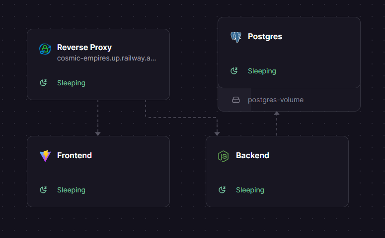

# text-based-browser-game-1

A space strategy game

## Architecture

The project is structured as a basic monorepo, where each folder is a deployable project.

The game will have:

- A single React frontend
- A single Express backend
- Hosted infra (db, reverse proxy)

Long term, the backend project will be split in two:

- API for the frontend
- Workers to simulate ticks

This will allow scaling the workers and the API appropriately. The workers might even be in another language more suited for CPU bound tasks.  
Until we start seeing performance problems, we won't need that, so we'll start with a single backend.  
However, since we know a single backend won't scale, we'll make sure the tick simulation is well isolated so that we can extract it quickly when needed.

All the tech choices are balanced to make sure we don't take on too many new things.  
For example, we chose:

- Typescript (proficient)
- React (proficient)
- Express (proficient)
- pnpm (familiar)
- Tanstack query (familiar)
- Tanstack router (new)
- No monorepo power tool (new)
- Drizzle (new)
- Clerk (new)
- Railway (new)
- Postgres (new)

While Express and Typescript everywhere might not be the most suitable options, they'll give us a safe playground to learn the other necessary tools (auth, db and hosting, for the most part).

## Architecture Decision Records (ADRs)

Architecture Decision Records are simple snapshots of decisions that were made, with their status and context.  
They are all version controlled in the root [adr/](../adr/) directory.
