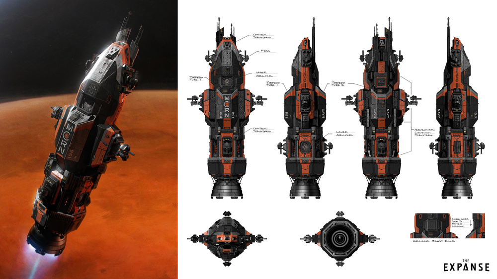
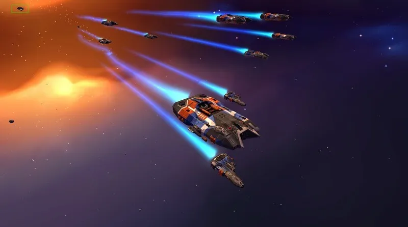
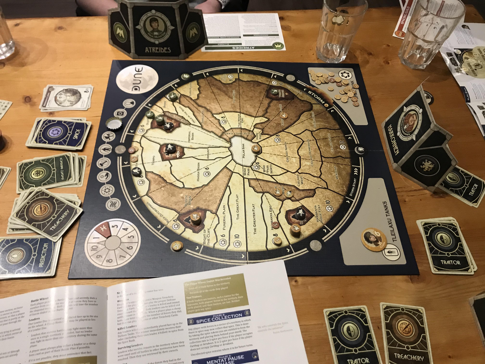
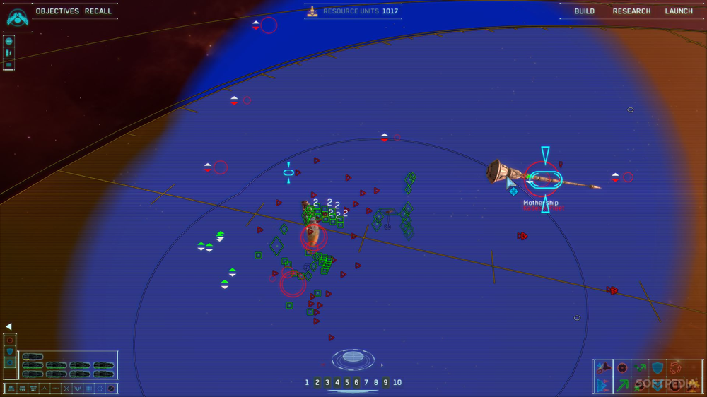
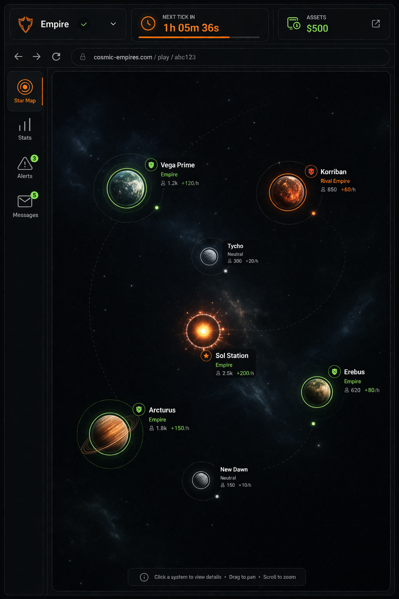
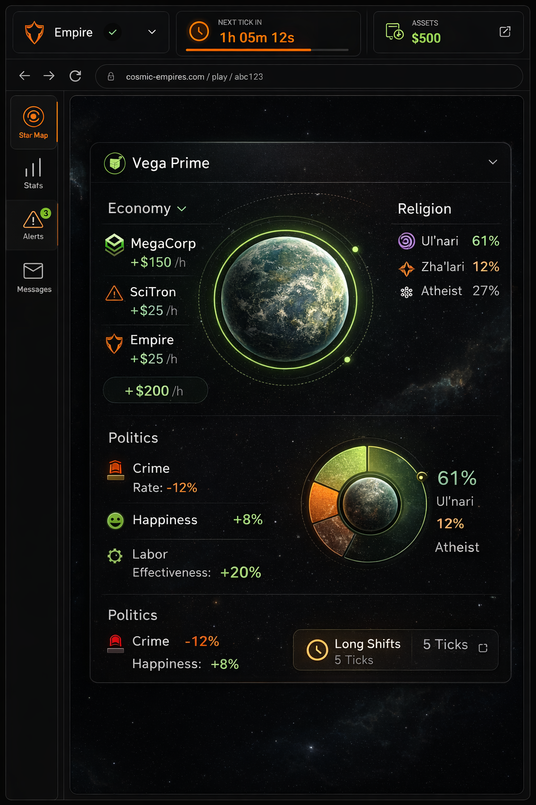

# MVP - Cosmic Empires

This document defines the minimum viable product for Cosmic Empires. It is an internal design brief: it should make the MVP direction clear enough to guide design, implementation and scope decisions without becoming a complete rules reference.

The MVP must prove that Cosmic Empires works as a long-turn, multiplayer, text-first strategy game with asymmetric Institutions, diplomacy, hidden intent, deterministic tick resolution and fully customizable rulesets.

The MVP includes:

- Three playable Institution types: Empires, Corporations and Faiths.
- A unified final player score built from all Institutions controlled or affiliated by that player.
- Long-turn, server-authoritative gameplay where players submit actions and ticks resolve deterministically.
- Meaningful diplomacy and partial information.
- A fully data-driven ruleset model that can configure mechanics, numbers, action availability and resolution order.
- A focused browser UI for desktop play. Responsive/mobile polish is not required for the MVP.

# High Level Concept

## Concept

Cosmic Empires is a multiplayer sci-fi 4X strategy game where players compete through military pressure, economic leverage, technological development, cultural influence, diplomacy and timing.

The game should feel like a computer-aided board game: the computer handles state, validation, hidden information, simultaneous turns and resolution, while the core fun comes from planning, negotiation and reading other players.

Players are not meant to win by reacting faster. They win by building a coherent plan over many turns, coordinating the right deals and using the right Institution at the right moment.

## Genre

Cosmic Empires is a browser-based, multiplayer, sci-fi 4X strategy game focused on long-term planning, diplomacy, asymmetric power systems and configurable rules.

It borrows from persistent browser strategy games, grand strategy games, negotiation-heavy board games and economic sandbox games, but the MVP should stay text-first and systems-first.

## Target Audience

The target audience is strategy players aged 20+ who enjoy long games with friends but cannot commit to real-time play sessions or constant monitoring.

These players are likely to enjoy games such as Astro Empires, Stellaris, Diplomacy, Axis & Allies, Twilight Imperium or Dune. They want strategic depth, political tension and room for clever plans, but they need a pace that fits around real-life commitments.

The MVP should serve players who can check in once or a few times per day, review the state of the game, negotiate, submit orders and then wait for the next turn to resolve.

## Unique Selling Points

Most space strategy games collapse toward military dominance. Cosmic Empires must make force useful without making it the only rational path.

The MVP does this through three playable Institution types:

- Empires control territory, population, law, diplomacy and military posture.
- Corporations exploit resources, build infrastructure, create economic leverage and offer specialized services.
- Faiths influence politics, gather intelligence, shape social pressure and execute covert operations.

Each Institution type has a different role in the game, but all contribute to the player's unified final score. An Empire is openly tied to the player. Corporations and Faiths can create uncertainty because their ownership or affiliation may not always be public unless the player reveals it or the ruleset requires it.

This structure should create deals where players do not always know who benefits. A player might negotiate with a corporation that secretly serves a rival empire, tolerate a faith because it helps their population or accept military protection that creates an economic dependency.

Ruleset customization is also part of the MVP identity. The game should ship with a default balance, but it should also let players define their own balance through rules customization. Players should be able to create alternate modes by changing numbers, enabled mechanics, action availability, turn pace and scoring emphasis.

# Product Design

## Player Experience and Game POV

The player is the strategic mind behind an Empire and any Corporations or Faiths they control or affiliate with. They are not only managing a nation-state; they are shaping a web of political, economic, military and ideological power.

Empires operate at the territorial and legal level. They own planets, govern populations, shape policy, control borders, authorize or restrict activity and decide when to threaten or use force.

Corporations operate through specialization and leverage. They extract resources, build infrastructure, develop technologies, fulfill contracts and make themselves useful or indispensable to other players.

Faiths operate through influence, belief, pressure and secrecy. They can shape political incentives, gather information, support or undermine other Institutions, and create long-term consequences that are not always obvious immediately.

The MVP player experience should be:

- Review the current state and previous tick outcomes.
- Identify whether the current long-term plan still makes sense.
- Negotiate, coordinate, threaten or mislead through diplomacy.
- Allocate actions across Empire, Corporation and Faith Institutions.
- Ready up or wait for the turn timer.
- Read the resolved results and adapt.

Players should feel that they are executing a large-scale plan, not optimizing isolated tactical clicks. A strong turn might not score immediately if it creates leverage for a later payoff.

Diplomacy should be a calculated risk. Good deals can create a winning position, but because not all ownership, affiliation or intent is public, players will need social reading to assess if a deal is good for them and doesn't benefit a rival more.

## Visual Style

Cosmic Empires is a space strategy game, but it is also a browser text game. The UI should provide atmosphere and clarity without relying on expensive visual production for every object.

The MVP should feel polished, high-tech and serious. It should use visual assets selectively to establish tone, orient the player, and make important game surfaces feel tangible. The fantasy should still live mostly in the player's head, supported by clean information design and evocative language.

The visual direction is inspired by Dune, The Expanse and Homeworld 2: tactical, political, industrial, and grounded rather than flashy or arcade-like.

### Ships

| The Expanse Rocinante                                                   | Homeworld 2 Corvettes                                                         |
| ----------------------------------------------------------------------- | ----------------------------------------------------------------------------- |
|  |  |

### Maps

| Dune Board Game Map                                            | Homeworld 2 Tactical Map                                                       |
| -------------------------------------------------------------- | ------------------------------------------------------------------------------ |
|  |  |

### AI Generated UI

| AI Generated Solar System UI                                                       | AI Generated Planet UI                                                 |
| ---------------------------------------------------------------------------------- | ---------------------------------------------------------------------- |
|  |  |

## Game World Fiction

Humanity has colonized the solar system and is approaching the point where expansion beyond it may become possible. Different factions now compete to define the future: mercantile blocs, technocratic societies, authoritarian powers, ideological movements, industrial networks and covert institutions.

Open war is not constant, but tensions are high. Small conflicts, proxy struggles, resource disputes, political sabotage and ideological movements shape the balance of power.

The MVP should present enough fiction to make the systems feel grounded. Players should understand why Empires, Corporations and Faiths coexist, overlap, and compete:

- Empires need resources, legitimacy, security and population support.
- Corporations need access, contracts, protection and markets.
- Faiths need believers, influence, secrecy and ideological momentum.

The fiction should support player choice rather than prescribe a fixed story. A player can lead a mercantile empire, a progressive technocracy, a militarized hegemon, a quiet economic network or an ideological movement hiding behind other powers.

## Monetization

The MVP should be free to play and must not include pay-to-win mechanics.

All quality-of-life features will be available to all players, but eventually will be offered to paying users only. These features will never provide an in-game advantage.

## Platforms, Technology and Scope

The MVP is a desktop-first browser game with a backend server to process ticks and a database to persist games.

Mobile may work incidentally, but responsive UI is not a release requirement for the MVP. The main requirement is that a player on a desktop browser can create or join a game, review state, communicate, submit actions, and follow tick results clearly.

The MVP is designed for a one-developer team. Scope should favor a complete, coherent strategic loop over a large number of shallow mechanics.

# Game Systems Design

## Core Loops

The core loop is turn submission followed by deterministic tick resolution.

During a turn, players review the current game state and choose actions from the Institutions they control. Actions can come from Empires, Corporations, Faiths, territories, buildings, units, technologies, treaties or other ruleset-defined objects.

When players are done, they can mark themselves ready. The tick resolves when all required players are ready or when the turn timer expires. Resolution is server-authoritative and deterministic: the backend validates submitted actions, orders them according to the ruleset, applies their effects, advances the game state and schedules the next tick.

The moment-to-moment MVP loop is:

- Open the game and inspect the current tick.
- Review event logs and previous outcomes.
- Check available actions and resources for each Institution type.
- Exchange messages, offers, threats, contracts or treaty proposals.
- Submit orders for Empires, Corporations and Faiths.
- Ready up.
- Return after resolution to understand what changed.

The strategic loop is:

- Choose a path to victory through territory, economy, technology, culture, influence, diplomacy or force.
- Build the Institutions and relationships needed to support that path.
- Use partial information to hide intent or expose rivals.
- Trade short-term gains for long-term position.
- Adapt when other players reveal their plans.

The MVP should support specialization. A player should be able to lean into military power, economic services, technology, ideology, diplomacy or hybrid strategies. No single path should automatically dominate every ruleset.

## Objectives and Progression

The MVP has no meta-progression requirement. A player joins a game, plays it to completion, receives a final result and can start another game.

Within a game, the objective is to maximize the unified score. That score comes from the combined performance of the player's Empire, Corporations and Faiths. The exact scoring formula is ruleset-defined, but the default MVP ruleset should reward multiple viable strategies rather than only conquest.

Short-term goals should include:

- Securing resources and action capacity.
- Understanding the previous tick to determine rival strategies and Institution allegiances.
- Making useful deals.
- Positioning Institutions for future turns.
- Avoiding obvious exposure to rivals.

Long-term goals should include:

- Building a durable scoring engine.
- Creating leverage over other players.
- Controlling or influencing valuable locations.
- Developing specialized Institutions that other players must account for.
- Timing major actions for maximum payoff.

The MVP should include enough documentation in the UI or companion docs for players to understand rules, actions, scoring and tick order. A full tutorial is not required, but the beginner/default ruleset should be forgiving enough that new players can learn by playing.

## Game Systems

The MVP needs the following product systems:

- Game creation, joining, starting, active play, completion and winner display.
- Authentication and player access control.
- Persistent game state and history.
- Server-authoritative action submission and validation.
- Long-turn tick processing in a worker thread.
- Event logs that explain relevant tick outcomes.
- Player messaging and diplomacy surfaces.
- Ruleset configuration and persistence.
- Data-driven UI that can show available ruleset-driven actions and state.

The MVP needs the following game systems:

- Empires as territorial and political Institutions.
- Corporations as economic and infrastructure Institutions.
- Faiths as influence, information and ideological Institutions.
- Resources and currencies.
- Action budgets or action capacity.
- Movement or spatial positioning.
- Alliances, treaties, contracts or similar diplomatic commitments.
- Scoring and end-game resolution.
- Technology, progression or unlock systems where needed to support long-term planning.
- Trade or exchange systems that let players create interdependence.

Rulesets are a first-class MVP system. A ruleset should define:

- Enabled mechanics.
- Static game attributes such as player count, map size, turn duration, starting resources and game length.
- Institution types, objects, resources, units, buildings, technologies or equivalent game pieces.
- Available actions, their costs, requirements, targets, effects and scoring impact.
- Resolution order for mechanics and actions.
- Visibility rules for ownership, affiliation, actions, events and outcomes.
- Victory and scoring rules.

The implementation should support presets, but presets are not a substitute for the underlying data-driven model. The default ruleset should demonstrate the intended game identity; custom rulesets should demonstrate that the architecture can support alternate balance and modes.

## Interactivity

Cosmic Empires is a tick-based simulation. Players see the current state, submit orders and then see the results after the tick resolves.

The MVP should use interactivity in four main ways:

- Strategic interaction: players choose actions that shape future turns.
- Social interaction: players communicate, negotiate, coordinate and deceive.
- Information interaction: players interpret logs, hidden ownership, public state and partial signals.
- Systems interaction: players adjust to ruleset-defined costs, timing, scoring and resolution order.

Everything important must be deterministic and server-authoritative, but not everything must be public. The game should clearly distinguish between known facts, visible outcomes, hidden information and player claims.

The UI exists to make the game readable and atmospheric. It should reduce bookkeeping, expose meaningful choices and help players understand why the tick resolved the way it did. The underlying game should still be compelling to players who would enjoy it as a large spreadsheet, but the MVP should present that spreadsheet as a coherent sci-fi strategy experience.

## MVP Success Criteria

The MVP is successful when:

- A player can create or join a game.
- Multiple players can participate in the same game over multiple ticks.
- Players can submit meaningful actions through Empires, Corporations and Faiths.
- Tick processing resolves actions deterministically and advances the game state.
- Players can understand major outcomes through event logs or equivalent feedback.
- Diplomacy and partial information matter to the result.
- The game can end and show a unified winner or final score.
- Rulesets can materially change balance, enabled mechanics, action behavior, resolution order and scoring.

The MVP does not need production-scale balancing, mobile polish, monetization, a complete tutorial or a large content library. It does need a complete strategic loop that proves the game can create interesting long-term decisions.

## Glossary

- Institution: An independent playable entity. Each institution has a separate Action and Resource pool.
  - Empire: A territorial and political Institution.
  - Corporation: An economic and infrastructure Institution.
  - Faith: An ideological and influence-based Institution.
- Owner: Who controls an Institution or other game object. Ownership can be hidden information.
  - Affiliation: An official declaration of Institution ownership.
- Ruleset: The game's data-driven rule definition.
- Action: An Institution command submitted by a player.
- Resource: Currency that can be spent as an Action cost.
- Treaty: A formal diplomatic commitment.
- Contract: A formal economic agreement.
- Tick: The server-resolved step that advances the game state.
- Turn: The play period before the next Tick.
- Event Log: A record of important Tick outcomes.
- Unified Score: A player's final combined score.
