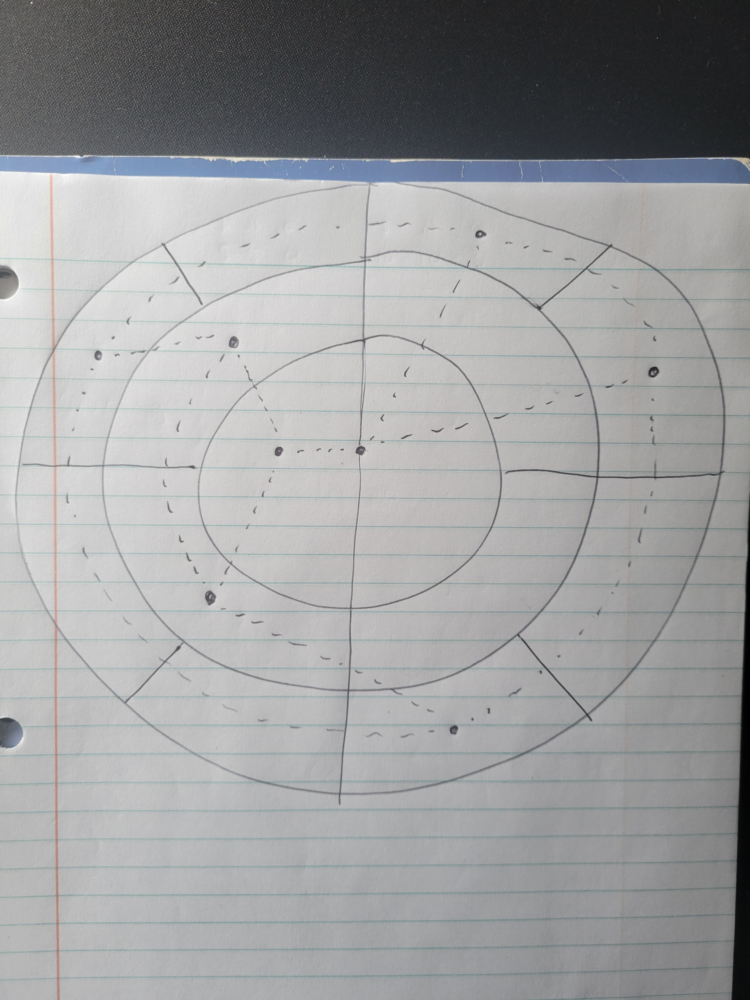

# Coordinate System and Movement

This document describes how the star map will be built based on a 5-tier coordinate system and graph structure to allow movements in the game.

## Description

### The World

The world will feature a `System:Orbit:Sector:Body:Site` coordinate system. The coordinate system will be read from left to right and any coordinate will contain one to five of the five tiers.

For example, these are all valid coordinates:

- `01` (system 1)
- `01:02:11` (system 1, orbit 2, sector 11)
- `01:02:11:05:03` (system 1, orbit 2, sector 11, body 5, site 3)

While all the above coordinates will be valid, not all of them will be valid for movement. Players will be able to view any of those coordinates. A link to `01:02` would bring the view of the player to system 1, orbit 2. However, units will only be able to move to Body or Sites.

For example, these are the coordinate capabilities:

- `01` (view)
- `01:02` (view)
- `01:02:11` (view)
- `01:02:11:05` (view and movement)
- `01:02:11:05:03` (view and movement)

The Orbit 1 will always be an Orbit with 1 Sector that contains the central Star.

The game creation menu will allow customizing the following aspects:

- Number of Systems (range)
  - Planet density (range)
  - Number of Planets per System (range)
  - Number of Sites per Planet (range)
  - Number of Sites per Home Planet (range)
- Presence of Moons (yes/no)
  - Number of Moons per Planet (range)
  - Number of Moons per Home Planet (range)
  - Number of Sites per Moon (range)
  - Number of Sites per Home Moon (range)
- Presence of Asteroids (yes/no)
  - Number of Asteroids per Sector (range)
  - Number of Sites per Asteroid (range)

Here's a representation of a System with 3 orbits and 14 sectors


The central dot is the Star, each circle is an Orbit and each dot on an Orbit is a Sector.

In this image, the Sector count per Orbit starts at 1 (the Star) and doubles for each additional Orbit.

Asteroids will be featured through Asteroid belts. An Asteroid belt is an orbit where each sector contains Asteroids only. There can be one or more Asteroid per Sector. Any Orbit can be an Asteroid belt, this will be chosen at random. In the core Ruleset, Asteroids will have a single Site and won't be claimable, like Planets or Moons.

Moons will be attached to planets. Visually, a Moon will orbit around a Planet. However, this will have no incidence on movement. In the core Ruleset, Moons will have fewer Sites than Planets.

### Movement

We can only move to Planets or Sites:

- Each Site is connected to the lower orbit of its Body.
- Each Body is connected to all Bodies in the same Sector.
- Each Body in a Sector is connected to all Bodies in the closest Sector clockwise on the same Orbit.
- Each Body in a Sector is connected to all Bodies in the closest Sector anti-clockwise on the same Orbit.
- Each Body in a Sector is connected to all Bodies in the closest Sector (absolute distance) of the lower Orbits.

Here's an example:


When moving, distance does not matter for now.

This can be represented as a graph, where each edge has a weight of 1.

## Architecture

The map will be stored in a relational database with the following tables:

- Maps: all maps, by game id, and their generation settings
- Systems
- Orbits
- Sectors
- Bodies
- Sites

The movement graph will be stored in a relational database with the following tables:

- MovementNodes: nodes that can be moved to (currently Bodies and Sites)
- MovementEdges: the connections between nodes

This data will only be used to validate movements. Units and buildings will always refer to Bodies or Sites, never to MovementNodes.

The frontend will consume DTOs derived from this data:

- MapDTO: All the information about the map to render it (movement graph, Systems, Orbits, Sectors, Bodies and Sites) with limited details about each Body and Site
- BodyDTO: Detailed information about a Body
- SiteDTO: Detailed information about a Site

### game_maps table

| Column                | Type        | Constraints                                           | Notes                                            |
| --------------------- | ----------- | ----------------------------------------------------- | ------------------------------------------------ |
| `game_id`             | `integer`   | primary key, references `games(id)` on delete cascade | The map belongs to one game.                     |
| `generation_seed`     | `integer`   | not null                                              | Seed used to generate the map deterministically. |
| `generation_settings` | `jsonb`     | not null                                              | Map generation settings used for this game.      |
| `created_at`          | `timestamp` | not null, default now                                 | Creation timestamp.                              |

The generation settings will have the following shape:

```ts
type Range = {
  /**
   * Inclusive
   */
  min: number
  /**
   * Inclusive
   */
  max: number
}

type MapGenerationSettings = {
  general: {
    nbSystems: Range
  }
  planets: {
    /**
     * Percentage between 0 and 1
     */
    planetDensity: Range
    nbPlanetsPerSystem: Range
    nbSitesPerPlanet: Range
    nbSitesPerHomePlanet: Range
  }
  moons: {
    enableMoons: boolean
    nbMoonsPerPlanet: Range
    nbMoonsPerHomePlanet: Range
    nbSitesPerMoon: Range
    nbSitesPerHomeMoon: Range
  }
  asteroids: {
    enableAsteroidBelts: boolean
    nbAsteroidsPerSector: Range
    nbSitesPerAsteroid: Range
  }
}
```

### game_map_systems

| Column          | Type      | Constraints                                                 | Notes                            |
| --------------- | --------- | ----------------------------------------------------------- | -------------------------------- |
| `id`            | `integer` | primary key, generated identity                             | Stable row id.                   |
| `game_id`       | `integer` | not null, references `game_maps(game_id)` on delete cascade | Parent map.                      |
| `system_number` | `integer` | not null                                                    | Coordinate segment, starts at 1. |

Indexes and constraints:

- Unique `(game_id, system_number)`.
- Index `(game_id)`.

### game_map_orbits

| Column         | Type      | Constraints                                                   | Notes                            |
| -------------- | --------- | ------------------------------------------------------------- | -------------------------------- |
| `id`           | `integer` | primary key, generated identity                               | Stable row id.                   |
| `game_id`      | `integer` | not null, references `game_maps(game_id)` on delete cascade   | Parent map.                      |
| `system_id`    | `integer` | not null, references `game_map_systems(id)` on delete cascade | Parent system.                   |
| `orbit_number` | `integer` | not null                                                      | Coordinate segment, starts at 1. |
| `sector_count` | `integer` | not null                                                      | Number of sectors on this orbit. |

Indexes and constraints:

- Unique `(system_id, orbit_number)`.
- Index `(game_id, system_id)`.

### game_map_sectors

| Column          | Type      | Constraints                                                  | Notes                            |
| --------------- | --------- | ------------------------------------------------------------ | -------------------------------- |
| `id`            | `integer` | primary key, generated identity                              | Stable row id.                   |
| `game_id`       | `integer` | not null, references `game_maps(game_id)` on delete cascade  | Parent map.                      |
| `orbit_id`      | `integer` | not null, references `game_map_orbits(id)` on delete cascade | Parent orbit.                    |
| `sector_number` | `integer` | not null                                                     | Coordinate segment, starts at 1. |

Indexes and constraints:

- Unique `(orbit_id, sector_number)`.
- Index `(game_id, orbit_id)`.

### game_map_bodies

| Column             | Type           | Constraints                                                   | Notes                                             |
| ------------------ | -------------- | ------------------------------------------------------------- | ------------------------------------------------- |
| `id`               | `integer`      | primary key, generated identity                               | Stable row id.                                    |
| `game_id`          | `integer`      | not null, references `game_maps(game_id)` on delete cascade   | Parent Map.                                       |
| `sector_id`        | `integer`      | not null, references `game_map_sectors(id)` on delete cascade | Parent Sector.                                    |
| `body_number`      | `integer`      | not null                                                      | Coordinate segment, starts at 1.                  |
| `body_type`        | `enum`         | not null                                                      | `PLANET`, `MOON`, `ASTEROID` or `STAR`.           |
| `can_be_owned`     | `boolean`      | not null                                                      | Whether this Body can be owned by a player.       |
| `owner_id`         | `integer`      | nullable, references `game_players(game_id, owner_id)`        | The id of the Player who owns this Body.          |
| `name`             | `varchar(255)` | not null                                                      | Body display name.                                |
| `movement_node_id` | `integer`      | not null, references `game_map_movement_nodes(id)`            | The id of the movement node for movement queries. |

Indexes and constraints:

- Unique `(sector_id, body_number)`.
- Index `(game_id, sector_id)`.
- Index `(game_id, owner_id)`.
- Check `((can_be_owned = false AND owner_id IS NULL) OR can_be_owned = true)`.

### game_map_sites

| Column             | Type      | Constraints                                                  | Notes                                             |
| ------------------ | --------- | ------------------------------------------------------------ | ------------------------------------------------- |
| `id`               | `integer` | primary key, generated identity                              | Stable row id.                                    |
| `game_id`          | `integer` | not null, references `game_maps(game_id)` on delete cascade  | Parent map.                                       |
| `body_id`          | `integer` | not null, references `game_map_bodies(id)` on delete cascade | Parent body.                                      |
| `site_number`      | `integer` | not null                                                     | Coordinate segment, starts at 1.                  |
| `movement_node_id` | `integer` | not null, references `game_map_movement_nodes(id)`           | The id of the movement node for movement queries. |

Indexes and constraints:

- Unique `(body_id, site_number)`.
- Index `(game_id, body_id)`.

### game_map_movement_nodes

| Column    | Type      | Constraints                                                 | Notes           |
| --------- | --------- | ----------------------------------------------------------- | --------------- |
| `id`      | `integer` | primary key, generated identity                             | Stable node id. |
| `game_id` | `integer` | not null, references `game_maps(game_id)` on delete cascade | Parent map.     |

### game_map_movement_edges

| Column         | Type      | Constraints                                                          | Notes                              |
| -------------- | --------- | -------------------------------------------------------------------- | ---------------------------------- |
| `game_id`      | `integer` | not null, references `game_maps(game_id)` on delete cascade          | Parent map.                        |
| `from_node_id` | `integer` | not null, references `game_map_movement_nodes(id)` on delete cascade | Origin node.                       |
| `to_node_id`   | `integer` | not null, references `game_map_movement_nodes(id)` on delete cascade | Destination node.                  |
| `weight`       | `integer` | not null, default `1`                                                | Movement cost. Always `1` for now. |

Indexes and constraints:

- Primary key `(game_id, from_node_id, to_node_id)`.
- Index `(game_id, from_node_id)`.

## Implementation Plan
