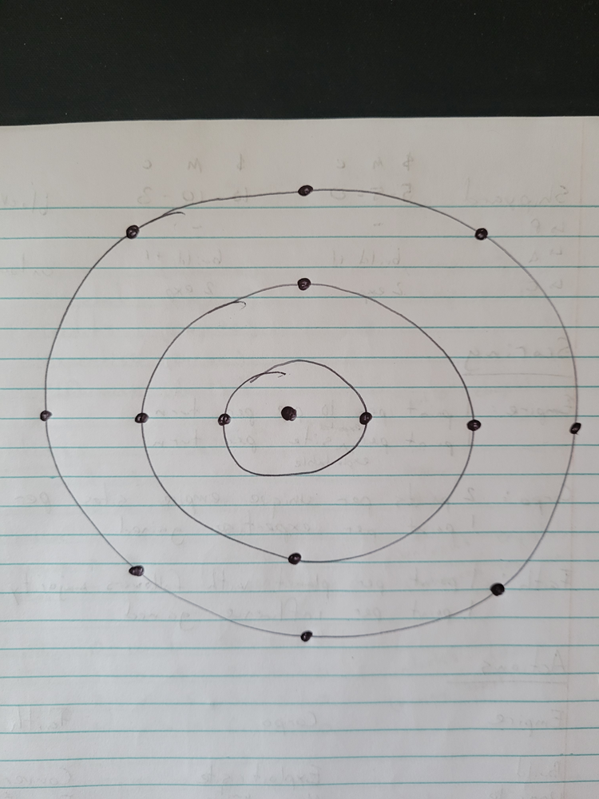
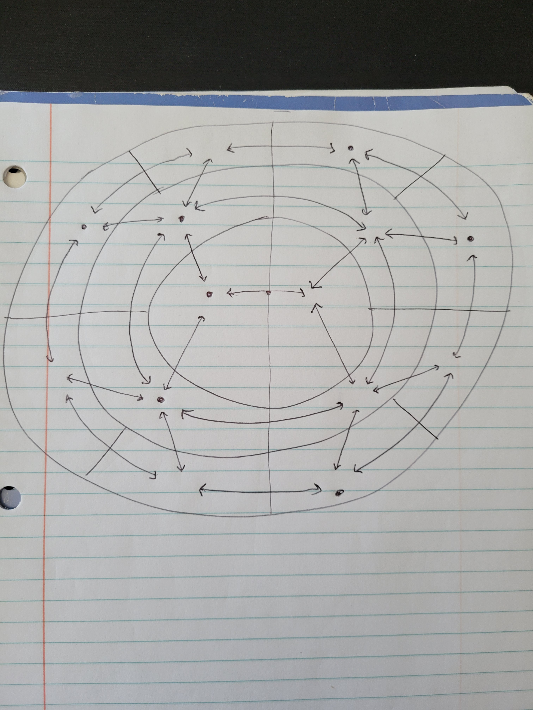
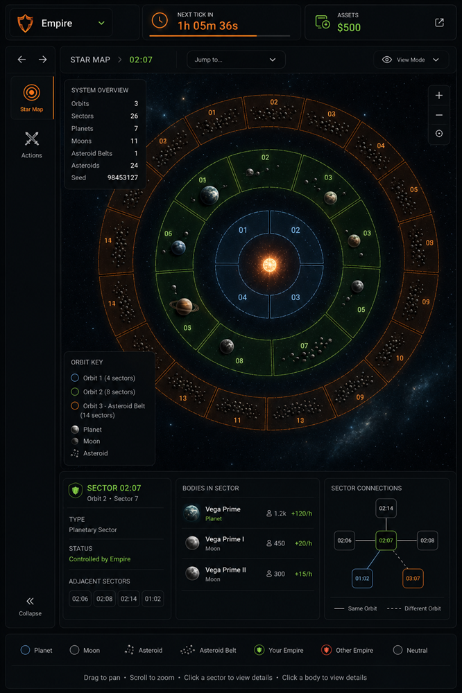

# Coordinate System and Movement

This document describes how the star map will be built based on a 3-tier coordinate system and graph structure to allow movements in the game.

## Description

### The World

The world consists of a single star system. At the center of the system will be a star, with concentric Orbits around it. Each Orbit will be divided into Sectors and each Sector will contain Bodies.

The world will feature a `Orbit:Sector:Body` coordinate system. The coordinate system will be read from left to right, and any coordinate will contain one to four of the four tiers.

For example, these are all valid coordinates:

- `02:11` (orbit 2, sector 11)
- `02:11:05` (orbit 2, sector 11, body 5)

While all the above coordinates will be valid, not all of them will be valid for movement. Players will be able to view any of those coordinates. A link to `02` would bring the view of the player to orbit 2. However, units will only be able to move to Sectors or Bodies.

For example, these are the coordinate capabilities:

- `02` (view)
- `02:11` (view and movement)
- `02:11:05` (view and movement)

The star is artificial and only for display purposes. It is not a Body.

The game creation menu will allow customizing the following aspects:

- Planet density of the System (range)
- Number of Planets (range)
- Number of Moons per Planet (range)
- Number of Asteroid belts (range)
- Number of Asteroids per Sector (range)
- Seed (number, optional)

Here's a representation of a System with 3 orbits and 14 sectors


The central dot is the star, each circle is an Orbit and each dot on an Orbit is a Sector.

In this image, the Sector count per Orbit starts at 2 and doubles for each additional Orbit.

Asteroids will be featured through Asteroid belts. An Asteroid belt is an orbit where each sector contains Asteroids only. There can be one or more Asteroid per Sector. Any Orbit can be an Asteroid belt, this will be chosen at random.

Moons will be attached to planets. Visually, a Moon will orbit around a Planet. However, this will have no incidence on movement.

The world is completely public. Every player in the game can see everything.

### Movement

We can only move to Sectors and Bodies:

- Each Body is connected to all Bodies in the same Sector.
- Each Body in a Sector is connected to that Sector.
- Each Sector is connected to all adjacent Sectors.

Here's an example:


In the example above every Sector has 3 to 5 adjacent Sectors

This can be represented as a graph, where each edge (arrow) has a weight of 1.

## Architecture

The map will be stored in a relational database with the following tables:

- Maps: all maps, by game id, and their generation settings
- Orbits
- Sectors
- Bodies

This data will only be used to express static data about the entities, not mutable game state.

The movement graph will be stored in a relational database with the following tables:

- MovementNodes: nodes that can be moved to (currently Sectors and Bodies)
- MovementEdges: the connections between nodes

This data will only be used to validate movements. Units and buildings will always refer to Sectors or Bodies, never to MovementNodes.

The frontend will consume DTOs derived from this data:

- MapDTO: All the information about the map to render it (movement graph, Orbits, Sectors and Bodies) with limited details about each Sector and Body
- SectorDTO: Detailed information about a Sector
- BodyDTO: Detailed information about a Body

### World generation

A world will be generated deterministically from the user's settings and a seed. Users can provide a seed. If no seed is provided, a random one will be used.

The world generation algorithm will try to satisfy the user's settings with as few orbits as possible. To do so, it will:

1. Initialize the pseudo random number generator with the seed
2. Roll the density, number of planets and number of Asteroid belts ranges to get fixed values
3. Create the next orbit and roll for Asteroid belt
4. If not Asteroid belt, count the sectors, multiply by the desired density
5. If Asteroid belt, fill each Sector in the belt with X Asteroids, where X is rolled from the range of Asteroids per Sector
6. If there aren't enough sectors to satisfy the planet count, repeat from #2
7. Select all empty Sectors, shuffle them and put a Planet in the first Y, where Y is the desired number of planets
8. For each Planet, add Z Moons in that Sector, where Z is rolled from the range of Moons per Planet

Each orbit has double the Sectors than the previous one.

The movement graph is then computed, and all the data is saved to the DB.

The world will not change after being generated.

### game_maps table

| Column                | Type        | Constraints                                           | Notes                                       |
| --------------------- | ----------- | ----------------------------------------------------- | ------------------------------------------- |
| `game_id`             | `integer`   | primary key, references `games(id)` on delete cascade | The map belongs to one game.                |
| `generation_settings` | `jsonb`     | not null                                              | Map generation settings used for this game. |
| `created_at`          | `timestamp` | not null, default now                                 | Creation timestamp.                         |

The generation settings will have the following shape:

```ts
type Range = {
  /**
   * Inclusive
   */
  min: number
  /**
   * Inclusive
   */
  max: number
}

type MapGenerationSettings = {
  /**
   * Percentage between 0 and 1
   */
  planetDensityOfSystem: Range
  nbPlanets: Range
  nbMoonsPerPlanet: Range
  nbAsteroidBelts: Range
  nbAsteroidsPerSector: Range
  seed: number
}
```

### game_map_orbits

| Column         | Type      | Constraints                                                 | Notes                            |
| -------------- | --------- | ----------------------------------------------------------- | -------------------------------- |
| `id`           | `integer` | primary key, generated identity                             | Stable row id.                   |
| `game_id`      | `integer` | not null, references `game_maps(game_id)` on delete cascade | Parent map.                      |
| `orbit_number` | `integer` | not null                                                    | Coordinate segment, starts at 1. |

Indexes and constraints:

- Unique `(game_id, id)`, so child tables can use same-game composite foreign keys.
- Unique `(game_id, orbit_number)`.
- Index `(game_id)`.

### game_map_sectors

| Column             | Type      | Constraints                                                 | Notes                                             |
| ------------------ | --------- | ----------------------------------------------------------- | ------------------------------------------------- |
| `id`               | `integer` | primary key, generated identity                             | Stable row id.                                    |
| `game_id`          | `integer` | not null, references `game_maps(game_id)` on delete cascade | Parent map.                                       |
| `orbit_id`         | `integer` | not null                                                    | Parent orbit. Same-game foreign key listed below. |
| `sector_number`    | `integer` | not null                                                    | Coordinate segment, starts at 1.                  |
| `movement_node_id` | `integer` | not null                                                    | The id of the movement node for movement queries. |

Indexes and constraints:

- Unique `(game_id, id)`, so child tables can use same-game composite foreign keys.
- Unique `(orbit_id, sector_number)`.
- Unique `(movement_node_id)`.
- Foreign key `(game_id, orbit_id)` references `game_map_orbits(game_id, id)` on delete cascade.
- Foreign key `(game_id, movement_node_id)` references `game_map_movement_nodes(game_id, id)` on delete no action.
- Index `(game_id, orbit_id)`.

### game_map_bodies

| Column             | Type           | Constraints                                                 | Notes                                              |
| ------------------ | -------------- | ----------------------------------------------------------- | -------------------------------------------------- |
| `id`               | `integer`      | primary key, generated identity                             | Stable row id.                                     |
| `game_id`          | `integer`      | not null, references `game_maps(game_id)` on delete cascade | Parent Map.                                        |
| `sector_id`        | `integer`      | not null                                                    | Parent Sector. Same-game foreign key listed below. |
| `body_number`      | `integer`      | not null                                                    | Coordinate segment, starts at 1.                   |
| `body_type`        | `enum`         | not null                                                    | `PLANET`, `MOON` or `ASTEROID`.                    |
| `name`             | `varchar(255)` | not null                                                    | Body display name.                                 |
| `movement_node_id` | `integer`      | not null                                                    | The id of the movement node for movement queries.  |

Indexes and constraints:

- Unique `(game_id, id)`, so child tables can use same-game composite foreign keys.
- Unique `(sector_id, body_number)`.
- Unique `(movement_node_id)`.
- Foreign key `(game_id, sector_id)` references `game_map_sectors(game_id, id)` on delete cascade.
- Foreign key `(game_id, movement_node_id)` references `game_map_movement_nodes(game_id, id)` on delete no action.
- Index `(game_id, sector_id)`.

### game_map_movement_nodes

| Column    | Type      | Constraints                                                 | Notes           |
| --------- | --------- | ----------------------------------------------------------- | --------------- |
| `id`      | `integer` | primary key, generated identity                             | Stable node id. |
| `game_id` | `integer` | not null, references `game_maps(game_id)` on delete cascade | Parent map.     |

Indexes and constraints:

- Unique `(game_id, id)`, so sectors, bodies and edges can use same-game composite foreign keys.
- Index `(game_id)`.

Each movement node must belong to exactly one movement target: either one Sector or one Body. The DB uniqueness constraints prevent duplicate `movement_node_id` values inside each concrete target table; `WorldMapsRepository.createSystem` must create nodes and targets in one transaction and must not create orphan nodes or reuse one node across target types.

### game_map_movement_edges

| Column         | Type      | Constraints                                                 | Notes                                                 |
| -------------- | --------- | ----------------------------------------------------------- | ----------------------------------------------------- |
| `game_id`      | `integer` | not null, references `game_maps(game_id)` on delete cascade | Parent map.                                           |
| `from_node_id` | `integer` | not null                                                    | Origin node. Same-game foreign key listed below.      |
| `to_node_id`   | `integer` | not null                                                    | Destination node. Same-game foreign key listed below. |
| `weight`       | `integer` | not null, default `1`                                       | Movement cost. Always `1` for now.                    |

Indexes and constraints:

- Primary key `(game_id, from_node_id, to_node_id)`.
- Foreign key `(game_id, from_node_id)` references `game_map_movement_nodes(game_id, id)` on delete cascade.
- Foreign key `(game_id, to_node_id)` references `game_map_movement_nodes(game_id, id)` on delete cascade.
- Index `(game_id, from_node_id)`.

Movement edges are stored as directed rows. For undirected movement, the repository inserts both `A -> B` and `B -> A` in the same transaction.

### Repositories

We will need 1 new repository, the `WorldMapsRepository`. This repository will expose all the data about the map:

- `createSystem`: Creates a full system (orbits, sectors, bodies, full movement graph, etc)
- `getSystem`: Gets the full system data (orbits, sectors, bodies, full movement graph, etc)
- `getSector`: Gets the full sector data (bodies, units, sector movement graph, etc)
- `getBody`: Gets the full body data (type, other body properties, units, body movement graph, etc)
- `areNeighbors`: Given two sectors or bodies, returns if the two are adjacent

`getSystem` should return something along the lines of:

```ts
type System = {
  gameId: number
  orbits: Orbit[]
  movementGraph: MovementGraph
}

type Orbit = {
  id: number
  number: number
  coordinates: string
  sectors: Sector[]
}

type Sector = {
  id: number
  number: number
  coordinates: string
  bodies: Body[]
  movementNodeId: MovementNodeId
}

type Body = {
  id: number
  number: number
  coordinates: string
  name: string
  type: "PLANET" | "MOON" | "ASTEROID"
  movementNodeId: MovementNodeId
}

type MovementGraph = {
  edges: Record<MovementNodeId, MovementEdge[]>
}

type MovementNodeId = number

type MovementEdge = {
  id: number
  from: MovementNodeId
  to: MovementNodeId
  weight: number
}
```

### Controllers

We will need 1 new controller, the `WorldMapsController`. This controller will expose queries to the world:

- `getSystem`
- `getSector`
- `getBody`

The controller will make sure the player is allowed to see the data (must be a player in the game).

Creating a system using `WorldMapsRepository.createSystem` will be part of the `GamesController`.

Validating move orders using `WorldMapsRepository.areNeighbors` will be part of the `GamePlayerActionsController`.

### Routers

We will need 1 new router, the `WorldMapsRouter`. This router will expose queries to the world:

- `getSystem`
- `getSector`
- `getBody`

The router will make sure the player is authenticated and will forward the player id to the controller.

### Star Map View

The star map view will look something like this:

| inspiration 1                                                                         | inspiration 2                                                                             |
| ------------------------------------------------------------------------------------- | ----------------------------------------------------------------------------------------- |
|  |  |

The key points are:

- The game layout will feature a left navigation bar
- The game layout will feature a top game info bar
- The game layout will feature a central tile, islands style, for the current view

The navigation bar at this point will contain 2 pages:

1. Star Map, shows the map
2. Actions, lets the user chose actions

The star map itself should:

- Show the star in the middle
- Show each sector as a zone
- Show each body in the center of their sector
  - Moons should orbit around planets
  - Asteroids float in the sector
- Have a starry background
- Allow zooming and panning
- Have a coordinate input to zoom in on an Orbit/Sector/Body
- Allow selecting Sectors and Bodies and showing their information in the bottom section (coordinates, name, type, etc)
- Show the coordinates of Sectors but not of Planets because it would clutter the UI

Sectors should be ordered by their number and distributed on the Orbit with the first Sector starting at 12 o'clock (0 degrees) and proceeding clockwise. For example, with 4 sectors:

- Sector 1 should start at 0 degrees and end at 90 degrees
- Sector 2 should start at 90 degrees and end at 180 degrees
- Sector 3 should start at 180 degrees and end at 270 degrees
- Sector 4 should start at 270 degrees and end at 360 degrees

In terms of libraries/tech, we will start with SVG + d3-zoom:

- We will generate 1 asset for a Planet
- We will generate 1 asset for a Moon
- We will generate 1 asset for an Asteroid
- We will generate 1 asset for the star
- We will generate a few assets for the starry background
- We will use annular sector paths for Sectors

### Game Creation View

The game creation view will have an extra section for the 6 world generation settings.

## Implementation Phases

The work will be divided in multiple PRs, some dependent on others, but not all:

1. Database schema update & migration, WorldMapsRepository, WorldMapsController and WorldMapsRouter
2. Game view layout revamp and Actions view revamp
3. Game creation view update, GamesController update with world generation algorithm
4. Star map view

Dependencies:

- 1 & 2 are completely independent
- 3 depends on 1, but can do everything and save the world to DB once 1 is done
- 4 depends on 1, 2 and 3

Any UI created should use the images as inspiration but should not change the current Shadcn preset.
