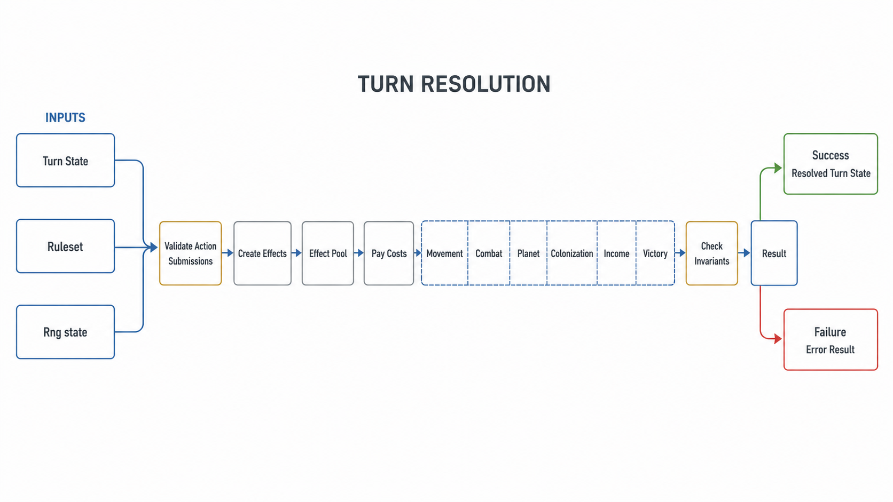
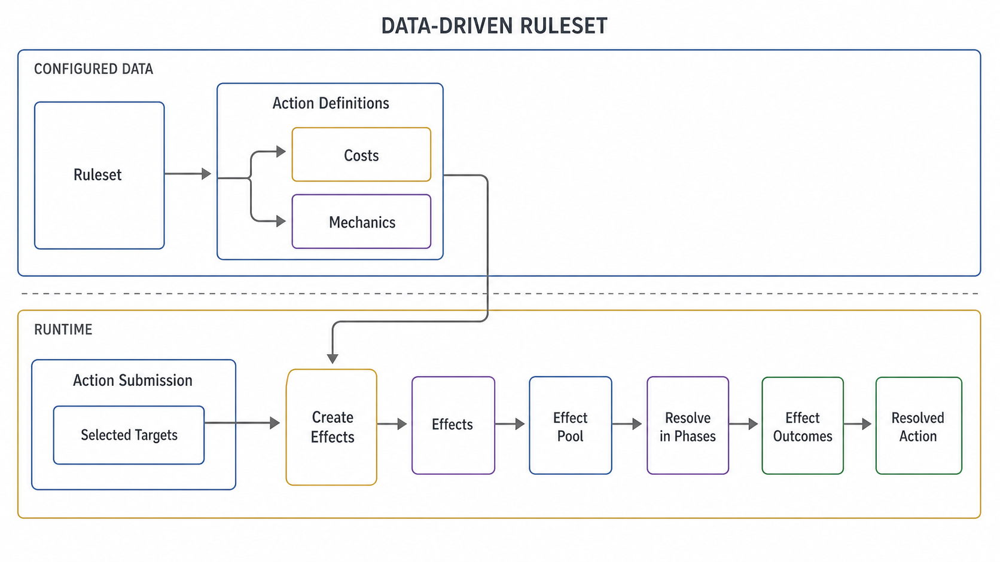
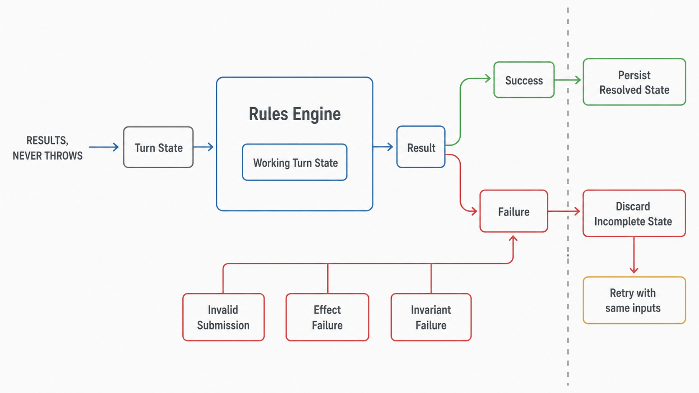

# Rules Engine

The Rules Engine is the persistence agnostic engine to resolve game turns.

The Rules Engine works by converting Actions Submissions into their corresponding Effects that are resolved in Phases.

The Actions are a data driven composition of Mechanics, where each Mechanic maps to an Effect during resolution. This allows creating (almost) any kind of Action for free as long as they use existing Mechanics.

Because the Rules Engine is data driven and persistence agnostic, we could play games entirely offline, in the terminal, for example. We had a version of this, but it was cumbersome to maintain, and we're very well-equipped to test this easily via unit tests, router tests and playwright tests.

## Ruleset

The Rules Engine defines clear models to define Actions. The Ruleset and its Actions are entirely data driven.

The Rules Engine owns the Ruleset model, the supported Mechanics and the Phase ordering and Effect resolution.

This means that creating Actions and balancing the game is nearly free, and multiple concurrent games can use different Rulesets. Adding mechanics is also quite easy.

However, it also means that removing Mechanics entirely or changing how Effects are resolved is a breaking change that should be reviewed carefully. At a later stage, we will probably have to introduce engine versioning to support multiple engines.

When we support multiple engines, we will probably prevent games from starting with old engine versions so that we can get rid of the code once all games running on that version are over. It's also possible that we keep multiple engines, but we'd highly prefer supporting a single engine and many Rulesets than supporting many engines.

## Determinism

The rules engine is deterministic. Given the same Rng state, Turn State and Ruleset, the results will always be identical. This is important for testing and reproducibility.

## Failure modes

The Rules Engine never throws, even for failed invariant checks. It always returns Results. This is because the Rules Engine will be used on a worker, and the Rules Engine state is confined to its inputs. Fatally throwing then crashing here would cause the worker to fully restart, which costs an unnecessary downtime and higher memory usage. Aborting the process this way will not clear any corrupted data, as the Rules Engine will not rely on process wide data to clean up.

Because of this, the use of the `Assert` module is not permitted there.

## Validation

All action submissions are validated before any resolution starts. Any invalid action fails the turn. Every action is expected to have been validated already on submission using the same validators.

Action target slots use the base entity types `FLEET`, `PLANET`, and `PLAYER`. Eligibility rules are separate, composable Target Constraints instead of refined target types. The validator resolves a selected id to a discriminated `{ type, entity }` target, reports ordinary target-shape or lookup issues first, and then evaluates every effective constraint with the submitting player and Turn State.

Constraint evaluators return a `Result`: an empty successful issue list means the target satisfies the constraint, a non-empty successful list contains ordinary eligibility problems, and a failure identifies invalid Ruleset data or an internal evaluation condition. Evaluator failures retain the submission, Action Definition, target tag, and underlying cause through validation and Turn Resolution rather than being converted to ordinary player issues.

Each constraint implementation owns a type-safe factory, an explicit standalone Zod schema, its supported base Target Types, and its evaluator. The complete constraint schema is an explicit discriminated union, and an exhaustive object-literal registry provides direct constant-time implementation lookup. `OWNED_BY_SUBMITTING_PLAYER` is currently the only implemented constraint and contains all target-ownership eligibility knowledge.

Mechanics declare target requirements as `{ tag, type, constraints }`, while Action target slots declare `{ type, constraints }`. A target must match the base type exactly. Effective constraints are composed without deduplication: cost-Mechanic constraints first, then other Mechanic constraints in declaration order, then Action-slot constraints. This preserves AND semantics and prevents an Action from weakening a Mechanic requirement.

The schema supports `ACTION_TARGET` and `MECHANIC_TARGET` reference values for future constraints, but the runtime currently supplies no resolved references. Relational constraint resolution, dependency graphs, candidate generation, movement, range, and stationing are outside the current implementation.

The persisted Ruleset JSON shape changed with target definitions and constraints. The former scalar target shape and refined target types are intentionally unsupported; with no production users, compatibility is handled by resetting and reseeding Ruleset data rather than migrating old JSON.

A failed turn state is expected to not be persisted, as the turn resolver stopped at the first error and the state is probably incomplete.

If any Effect fails to process at a later time, for any reason, then the turn will also be failed. Passing the validation should ensure that every Action will be able to resolve correctly, so if an Effect cannot properly resolve, it will be treated as fatal and fail the turn.

## Turn Context

The Turn Context is what every Effect will work on. It notably contains the Turn State to mutate and the Effect Pool to draw Effects from.

### Turn State

Every Effect mutates the Turn State, for simplicity and performance.

### Effect Pool

Effects are added and picked from the Effect Pool.

Effect resolution in the Effect Pool is handled by the Effect base class to ensure every call to `effect.resolve()` is recorded.

## Pipelines

The Rules Engine is structured as a series of generic pipelines:

- turn pipeline
- validation pipeline
- phases pipeline

### Turn Pipeline

The turn pipeline is the highest level. It orchestrates the high level concepts within a turn:

- Initialization
- Action Validation
- Effect Creation
- Effect Resolution Phases
- Invariant Checks
- Assembling the final state

### Validation Pipeline

The validation pipeline handles validating action submissions for any data that could be corrupted or inconsistent:

- Action Definition Mappings
- Action Target Mappings
- Action Costs Eligibility

### Phases Pipeline

The phases pipeline handles Effect resolution:

- Pay Costs
- Fleet Movement
- Fleet Builds
- Fleet Combat
- Planet
- Colonization
- Income
- Victory

Effects can be added to the Effect pool through other Effects during the Phases.

After all phases are done, we expect all effects to have been resolved.
