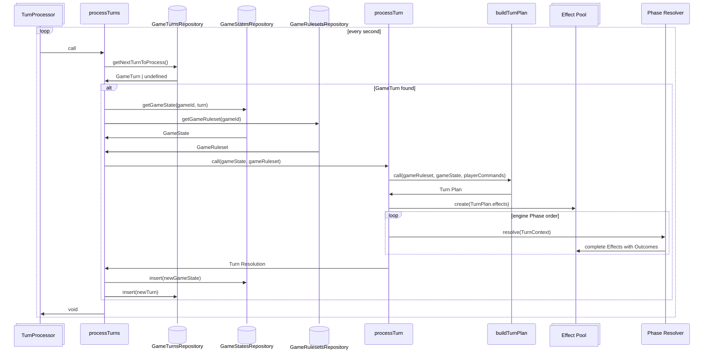

# Turn processing (target architecture)

The turn processing pipeline aims to be entirely data driven.

Every game will configure its ruleset, which defines:

- the enabled game mechanics (diplomacy, messaging, war, science, basic income, etc)
- the game mechanics attributes (treaty costs, messaging scope, warship damage multiplier, etc)
- every building, unit, etc, their costs, their stats and the actions they offer
- static game attributes (starting resources, solar system size, action count multiplier, turn rate, etc)

There will be presets for ease of use, but the idea is that every game-specific rule configuration will be stored in the DB for each game.

The engine, rather than the ruleset, defines the supported turn-resolution Phases, their fixed order, and the order of supported Mechanic types within each Phase.

Players may eventually be able to tweak the Ruleset-supported settings.

The turn processing pipeline will:

- take as input the game state and ruleset
- determine non-player actions that will occur
- validate locked Action Submissions and compile their Mechanics into a deterministic Turn Plan
- resolve the Turn Plan's Effects through the engine-defined Phases
- record structured submission diagnostics and Effect Outcomes
- proceed to next turn

The goal of this is to be able to add / change the game mechanics with minimal changes to the turn processing.

To add a game mechanic, we only have to define the actions that this mechanic has, and implement each action. The rest should fit neatly into the pipeline.

For mechanics that introduce things that are already supported by the game (like new units, new buildings), then there is nothing to implement, just data to add.

Tweaking Action numbers and composing existing Mechanics should require 0 backend changes, only changes to the persisted ruleset. Adding a new Mechanic type or changing Phase behavior requires an engine change.

