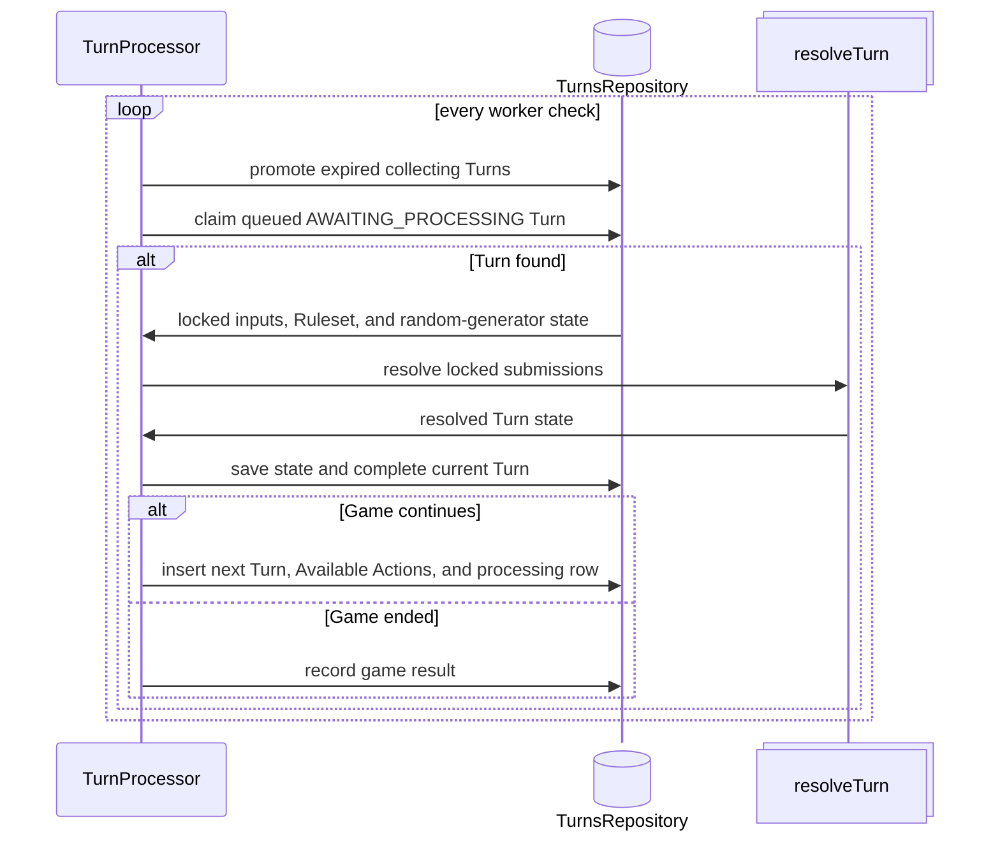

# Turn processing

The backend worker in `apps/backend/src/turn-processing` owns Turn scheduling, persistence, and orchestration. The shared [Rules Engine](turn-resolution.md) in `packages/shared/src/turn-resolution` owns deterministic resolution of the locked Action Submissions. This separation follows [ADR 011](./decisions/011-turn-processing-in-worker-thread.md) and [ADR 007](./decisions/007-code-sharing.md).

The turn processing pipeline doesn't know much about how turns are resolved. It only knows what data to supply to the `resolveTurn` function and how to handle the state that comes out.

## Current orchestration

1. `TurnProcessor` works on 2 tables: `turnsTable` and `turnsProcessingTable`. When a turn is created, a row is inserted in both tables immediately.
1. `TurnProcessor` promotes closed Turns rows from `COLLECTING_ACTIONS` to `AWAITING_PROCESSING`. Turns can also be closed and their scheduling updated by unanimous Readiness via the `apps/backend/src/api/`.
1. Through `TurnsRepository`, the worker claims a turnsProcessing row by locking the row, moves the Turns row to `PROCESSING`, and loads its locked submissions, game state, selected persisted Ruleset, and random-generator state.
1. The worker then unlocks the turnsProcessing row after setting the processing startDate, which prevents other workers from processing it.
1. The worker calls `resolveTurn` with those inputs. The Rules Engine revalidates submissions, creates their Effects, and resolves them through engine-owned Phases.
1. On success, the worker saves the resulting game state and moves the Turn to `COMPLETED`. If the game continues, it creates the next Turn, its Available Action Instances, and its processing queue row; otherwise it records the game as ended.

The diagram shows the successful resolution path. See [System 001-turns](../game-design/systems/001-turns.md) for the Turn lifecycle. Failure-mode policy reconciliation remains tracked in [#433](https://github.com/Guillaume-Docquier/text-based-browser-game-1/issues/433).

```mermaid
sequenceDiagram
        participant P3 as TurnProcessor
        participant P1@{ "type": "database" } as TurnsRepository
        participant P2@{ "type": "collections" } as resolveTurn
        loop every worker check
          P3->>P1: promote expired collecting Turns
          P3->>P1: claim queued AWAITING_PROCESSING Turn
          alt Turn found
            P1->>P3: locked inputs, Ruleset, and random-generator state
            P3->>P2: resolve locked submissions
            P2->>P3: resolved Turn state
            P3->>P1: save state and complete current Turn
            alt Game continues
              P3->>P1: insert next Turn, Available Actions, and processing row
            else Game ended
              P3->>P1: record game result
            end
          end
        end
```

## Ruleset and engine responsibilities

A game's selected Ruleset supplies its Action Definitions, their costs and composed Effect Definitions, its Action Pool, and starting Resources. Adding Actions that compose supported Effects or tuning their parameters can be a Ruleset data change.

Phase order belongs to the Rules Engine and is the same for every Ruleset. `resolvePhases` fixes that sequence in code; each Phase coordinates its own Effects. Changing Phase order or adding unsupported behavior requires engine changes. A Ruleset cannot reorder Phases.

Use the [Rules Engine guide](turn-resolution.md) for the implementation structure, [GDDR 009](../game-design/decisions/009-deterministic-data-driven-rules-engine.md) for the design decision, and [System 015-rules-engine](../game-design/systems/015-rules-engine.md) for the Phase table and current gameplay scope.

Rulesets are currently developer-authored and persisted. Immutable snapshots, versioning, and player-authored Rulesets remain future capabilities; System 015 records the current mutable-seed exception and planned authoring boundary.
